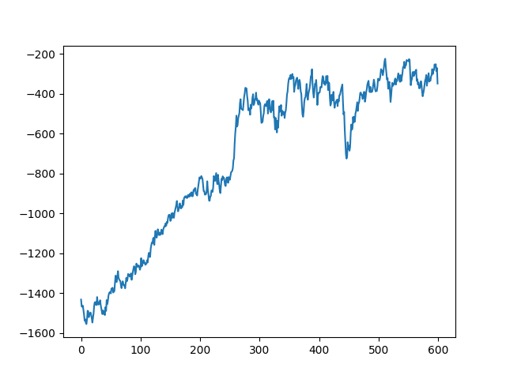

在PG算法中，策略梯度的计算公式如下所示：

$$
J(\theta) = E[R(\tau)]
$$
策略梯度可以表示为
$$
\nabla_\theta J(\theta) = \nabla_\theta \int \rho_\tau R(\tau) = \int \nabla_\theta \rho_\tau R(\tau) = \int \rho_\tau \nabla_\theta \log\rho_\tau R(\tau)
$$ 
$$
= E[\nabla_\theta \log\rho_\tau R(\tau)] = E[\sum_t\nabla_\theta \log[\pi_\theta(a_t| s_t)] A(s_t, a_t)]
$$

我们根据策略$\theta$采样得到的轨迹$\tau$做期望，但是，一旦更新了参数，我们的$\theta$就变了，采样的概率会发生变化，所以之前的数据就不能用了。

这导致的结果就是PG算法需要花很多时间去采样。

PPO的思想就是用另外一个actor$\theta^\prime$去跟环境互动（采样），然后将收集到的数据去更新$\theta$，将数据重复使用多次后再将$\theta^\prime$和$\theta$同步。

PPO: $$L(\theta) = E[\min(\frac{\pi_{\theta_k} (a_t| s_t)}{\pi_{\theta} (a_t | s_t)} A(s_t, a_t), clip (\frac{\pi_{\theta_k}(a_t| s_t)}{\pi_{\theta} (a_t|s_t)}, 1-\epsilon, 1+\epsilon)A(s_t, a_t))]$$

然后PPO利用了重要性采样来保证样本的策略分布和当前策略的的策略分布保持一致，此外利用clip方法保证策略更新的幅度不要过大。

